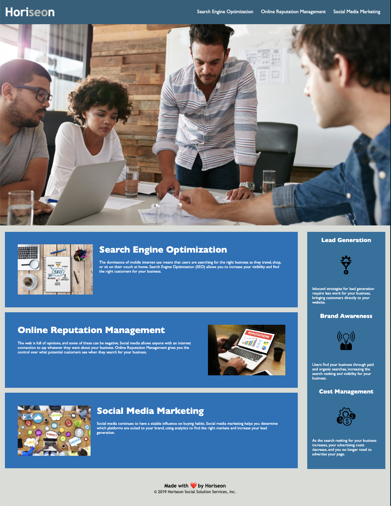

<!-- @format -->

# Bootcamp Challenge 01_html-git-css

Challenge for module 01

## Description

**The client Horiseon** requested a refactor of their current website to enhance SEO by ensuring it meets **accessibility standards**

## Link to deployed site and repository

- [Live Horiseon page on github.io](https://codewizard-dt.github.io/bootcamp_challenge_01_html-git-css/)
- [Link to repository](https://github.com/codewizard-dt/bootcamp_challenge_01_html-git-css)

> Refactors made
>
> - Added `alt` attributes to `img` tags
> - Added `role` and `aria-label` attributes to displayed images without content
> - Exchanged `div` tags for **semantic elements** such as `header`, `footer`, `nav`, `section`, `article`, and `aside`
> - Created new class names for similar elements to **condense style.css**
> - **Rearranged style.css** for readability, grouping related css rules together
> - Surveyed links to ensure they all work properly
> - Surveyed headers to ensure sequential ordering, i.e. **h1 > h2 > h3 > h4**
> - Updated title element to reflect page contents

---

## Screenshot

